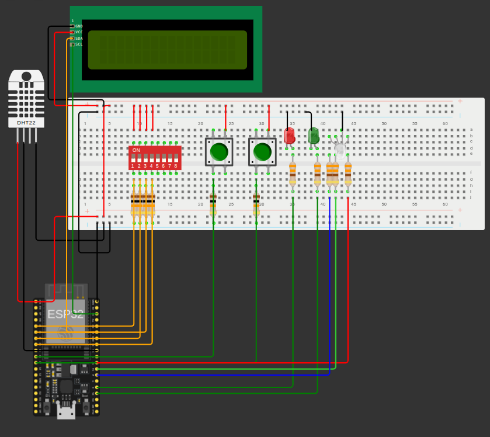
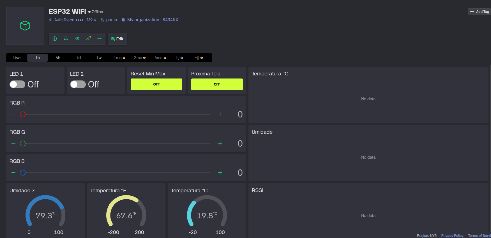
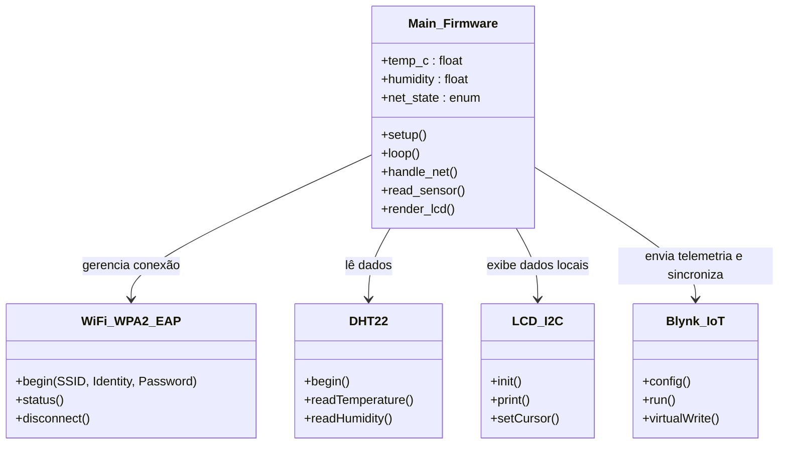

# Monitoramento de Temperatura usando Wi-Fi e ESP32

**Disciplina:** Tópicos Especiais em Computação XXVII (GEX1087)  
**Instituição:** Universidade Federal da Fronteira Sul (UFFS) - Campus Chapecó  
**Dupla:** Paula F. Padilha e Raul B. Magri  
**Opção Escolhida:** Opção A - Plataforma Blynk  

---

## 1. Links do Projeto
* **Simulação do Circuito (Wokwi):** https://wokwi.com/projects/468362243720082433
* **Esquema Digital:**


## 2. Interface e Dashboard
Abaixo estão os registros do painel de monitoramento e controle no Blynk:



## 3. Estrutura de Dados (Datastreams Blynk)
A comunicação entre o ESP32 e a nuvem utiliza a seguinte configuração de pinos virtuais:

| Pino Virtual | Nome / Função | Tipo de Dado | Direção |
| :--- | :--- | :--- | :--- |
| V0 | Temperatura °C | Double | ESP32 → Nuvem |
| V1 | Temperatura °F | Double | ESP32 → Nuvem |
| V2 | Umidade % | Double | ESP32 → Nuvem |
| V3 | RSSI (Qualidade do Sinal) | Integer | ESP32 → Nuvem |
| V4 | Temp C Mínima | Double | ESP32 → Nuvem |
| V5 | Temp C Máxima | Double | ESP32 → Nuvem |
| V6 | Umidade Mínima | Double | ESP32 → Nuvem |
| V7 | Umidade Máxima | Double | ESP32 → Nuvem |
| V8 | Controle LED 1 | Integer | Nuvem → ESP32 |
| V9 | Controle LED 2 | Integer | Nuvem → ESP32 |
| V10 | RGB Vermelho (R) | Integer | Nuvem → ESP32 |
| V11 | RGB Verde (G) | Integer | Nuvem → ESP32 |
| V12 | RGB Azul (B) | Integer | Nuvem → ESP32 |
| V13 | Reset Mín/Máx | Integer | Nuvem → ESP32 |
| V14 | Próxima Tela (LCD) | Integer | Nuvem → ESP32 |
| V15 | Bloqueio Local/Remoto | Integer | ESP32 → Nuvem |
| V16 | Unidade °C / °F | Integer | ESP32 → Nuvem |

## 4. Arquitetura e Fluxo do Firmware
*Nota: A modelagem lógica abaixo garante a operação não-bloqueante utilizando `millis()` e a máquina de estados para conexão Wi-Fi.*

### Diagrama de Classes Principais


### Fluxograma de Execução (Setup, Loop e Callbacks)
```mermaid
graph TD
    A([Início do Sistema - setup]) --> B[Inicializa Pinos, I2C e Serial]
    B --> C[Inicializa LCD e Sensor DHT]
    C --> D[Configura Auth Token do Blynk]
    D --> E[Define Timers e Lógicas de Estado]
    E --> F([Loop Principal])

    F --> G{handle_net}
    G --> H{Estado NET_CONNECTED?}
    H -- Sim --> I[Executa Blynk.run]
    H -- Não --> J[Tenta Reconexão]
    I --> K
    J --> K[Executa blynk_timer.run]
    
    K --> L[Leitura de Botões Físicos e Switches]
    L --> M{Tempo de ler sensor?}
    M -- Sim --> N[Ler DHT22, atualizar histórico e LCD]
    M -- Não --> O{Tempo de atualizar LCD?}
    N --> O
    O -- Sim --> P[Avança Tela]
    O -- Não --> Q([Fim do Ciclo])
    P --> Q
    Q --> F

    R([Callback BLYNK_WRITE]) -.-> S[Recebe comando da Nuvem]
    S -.-> T{Switch de Bloqueio ativo?}
    T -- Sim -.-> U[Ignora comando e ressincroniza estado físico]
    T -- Não -.-> V[Aplica alteração aos LEDs/Variáveis]
```

## 5. Instruções de Configuração e Execução
Para replicar este projeto, siga os passos abaixo para configurar o ambiente no Blynk IoT:
1. Crie uma conta em [blynk.io](https://blynk.io).
2. Vá em **Templates** > **New Template** e configure o hardware como ESP32 e conexão WiFi.
3. Na aba **Datastreams**, recrie a estrutura de variáveis informada na Tabela do item 3.
4. Na aba **Web Dashboard**, adicione os widgets (Gauges, Charts, Switches, Sliders e Button) e vincule-os aos respectivos Datastreams.
5. Vá em **Devices** > **New Device** > **From template** e selecione o template criado.
6. Copie as credenciais geradas (`BLYNK_TEMPLATE_ID`, `BLYNK_TEMPLATE_NAME` e `BLYNK_AUTH_TOKEN`) e substitua nas primeiras linhas do arquivo `sketch.ino`.
7. Insira as credenciais da rede WPA2-Enterprise (Identity e Password) no código e faça o upload para a placa.

## 6. Relato de Limitações Encontradas
Durante o desenvolvimento e homologação do projeto, identificamos uma restrição imposta pelo plano gratuito da plataforma Blynk. A retenção de dados históricos de alta resolução (*High-Resolution RAW* e *1-Minute Average*) é bloqueada por um paywall. Fomos obrigados a configurar o Data History dos datastreams como *Latest Value Only*. Para contornar essa ausência de persistência longa na nuvem, o gráfico (Chart) do dashboard visualiza o comportamento em tempo real apenas enquanto a aplicação web está aberta na sessão atual. 

Além disso, foi necessário lidar com as políticas de segurança da rede universitária (WPA2-Enterprise), que exigiram a implementação de bibliotecas específicas (`esp_eap_client.h`) para autenticação por identidade, desviando do padrão doméstico tradicional.
